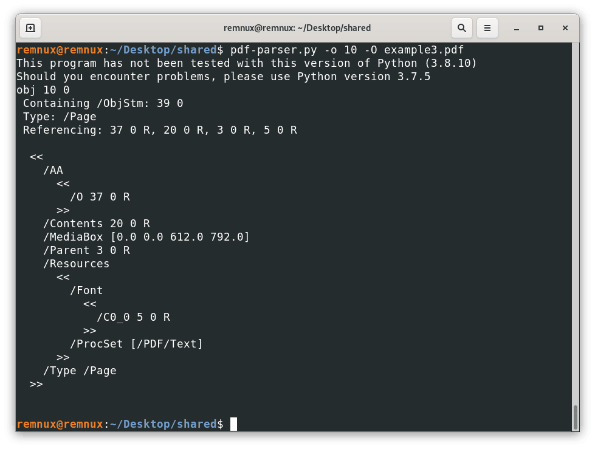

# Documentos PDF

Após a visão geral do gerenciamento de [máquinas virtuais e da instalação do Remnux como um ambiente para analisar artefatos suspeitos,](https://greaterinternetfreedom.org/course/part01-intro-and-vms/) exploraremos os arquivos PDF em termos de formato e de maneiras como eles podem ser usados para prejudicar as pessoas.&#x20;

## O que é um PDF?

Quando abrimos um arquivo PDF, usamos um programa específico que renderiza seu conteúdo de forma legível. No entanto, como muitos outros tipos de arquivo, os PDFs são criados usando uma combinação de texto simples, regular, e dados binários (para imagens e outros elementos que possam exigir isso). Por exemplo, o texto a seguir renderiza o arquivo PDF mostrado logo depois:

```txt
%PDF-1.4
1 0 obj
<<
	/Length 51
>>
stream
1 0 0 RG
5 w
36 144 m
180 144 l
180 36 l
36 36 l
s
endstream
endobj
2 0 obj
<<
	/Type /Catalog
	/Pages 3 0 R
>>
endobj
3 0 obj
<<
	/Type /Pages
	/Kids [4 0 R ]
	/Count 1
>>
endobj
4 0 obj
<<
	/Type /Page
	/Parent 3 0 R
	/MediaBox [0 0 612 792]
	/Contents 1 0 R
>>
endobj


xref
0 4
0000000000 65535 f
0000000010 00000 n
0000000113 00000 n
0000000165 00000 n
0000000227 00000 n
trailer
<<
	/Size 4
	/Root 2 0 R
>>
startxref
344
%%EOF
```

<figure><figcaption></figcaption></figure>

Fonte: "[_How to create a simple PDF file_](https://help.callassoftware.com/m/73261/l/798383-how-to-create-a-simple-pdf-file)" (Como criar um arquivo PDF simples) da Callas Software

#### Estrutura do arquivo PDF

A partir desse exemplo, podemos ver a estrutura padrão de qualquer arquivo PDF:

<figure><figcaption></figcaption></figure>

**Cabeçalho (h**_**eader**_**):** Contém a versão do protocolo com o qual o arquivo foi criado, para indicar ao programa leitor como ler o restante da estrutura e renderizar todos os seus elementos.

**Corpo (**_**body**_**):** Aqui estarão todos os objetos que compõem o arquivo PDF, páginas, imagens, texto, fontes etc. Até mesmo códigos e ações automatizadas, se o arquivo os tiver.

**Tabela de referência cruzada (**_**cross reference table**_**):** Aqui encontraremos uma lista de todos os objetos do documento para fácil acesso e seus respectivos locais dentro do arquivo. Isso é semelhante a um "índice", mas para ser lido pelo software leitor de PDFs. Se, a qualquer momento, o leitor precisar renderizar um objeto específico (por exemplo, se rolarmos para uma página aleatória em um documento grande), o software leitor verá qual página deve ser apresentada e a procurará nessa tabela para localizar os respectivos elementos no documento e carregá-los na tela.

**Reboque (**_**trailer**_**):** Aqui encontraremos a indicação de onde começa tabela de referência cruzada no documento e outras informações úteis "à reboque", como o número de objetos na tabela de referência cruzada (para verificar se o arquivo não está corrompido, por exemplo), o objeto raiz do documento e informações de criptografia, se aplicável. Por padrão, os leitores de PDFs começam a ler os documentos a partir do final, onde podem encontrar rapidamente onde está o objeto raiz e a tabela de referência cruzada para começar a renderizar o conteúdo.

### Entendendo os objetos do PDF

Considerando a forma como os PDFs são estruturados, a seção mais interessante para se aprofundar é o corpo do documento, pois lá se encontra tudo o que podemos ver e interagir (texto, páginas, imagens, formulários, código etc.). Todos esses elementos são chamados de objetos, e há uma grande variedade deles de acordo com as especificações. No exemplo acima, o objeto

```txt
4 0 obj
<<
	/Type /Page
	/Parent 3 0 R
	/MediaBox [0 0 612 792]
	/Contents 1 0 R
>>
endobj
```

é uma página com o id 4, tem um elemento pai com o id 3 e contém como filho o elemento com o id 1 (o retângulo vermelho). Mostrar a maneira exata como cada objeto é escrito está fora do escopo deste material; no entanto, há alguns tipos de elementos que podem ser usados para fins maliciosos, e queremos abordá-los.

_**/OpenAction**_: Esse objeto faz referência a um conjunto de ações a serem executadas quando o arquivo PDF é aberto, o que pode ser usado para iniciar um site para dar suporte ao conteúdo ou para fins de rastreamento, executar código JavaScript, etc. Isso pode ser usado para induzir os usuários a executar ações extras que podem ser prejudiciais ou, dependendo do ambiente do computador, esse objeto pode executar _malware_ diretamente.

_**/AA**_: esse objeto também inclui uma série de ações que são acionadas em circunstâncias variadas, como visualizar uma página, passar o ponteiro do mouse sobre objetos específicos, preencher campos de formulários etc. Os riscos associados são semelhantes aos do objeto/`OpenAction`, mas com muito mais cenários onde pode haver acionamento.

_**/JS**_ ou _**/Javascript**_: Contém código JavaScript a ser executado depois que uma ação é acionada; esse código pode incluir funções exclusivas para PDFs.

_**/Launch:**_ Tenta iniciar um aplicativo externo no dispositivo depois que uma ação é acionada, o que pode ser usado, por exemplo, para abrir outros documentos ou executar comandos específicos, que podem ser prejudiciais.

_**/EmbeddedFile**_: permite a inclusão de arquivos arbitrários entre os documentos executáveis dentro do PDF. Há antecedentes de arquivos PDF benignos contendo outros arquivos nocivos incorporados, como executáveis de _malware_ ou documentos do Microsoft Office com macros maliciosas.

_**/ObjStm**_: Contém informações arbitrárias que serão processadas de acordo com a forma como é chamado. O principal uso desse objeto é para agrupar muitos objetos e compactá-los, resultando em um arquivo menor. No entanto, ele também pode ser usado para compactar código malicioso, ofuscá-lo e evitar a detecção de antivírus. Considerando os muitos casos de uso diferentes para esse tipo de objeto, presumir sua presença como mal-intencionada resultará em muitos falsos positivos.

Em ataques mais elaborados, uma combinação desses objetos pode ser usada. Por exemplo, um PDF pode acionar uma ação que abre um arquivo incorporado, criptografado, em um `/ObjStm`.

Considerando tudo isso, queremos saber se um arquivo contém algum desses tipos de objetos, logo na primeira etapa, para verificar se um arquivo PDF é malicioso ou, pelo menos, para ter certeza de que não é.

### `Conheça o pdfid`

Uma vez que sabemos por onde começar a procurar sinais de alerta em arquivos PDF que consideramos suspeitos, podemos usar a ferramenta pdfid como primeira etapa para ver quais tipos de objetos estão contidos em nosso arquivo. O pdfid faz parte de [um conjunto de ferramentas desenvolvidas por Didier Stevens](https://blog.didierstevens.com/programs/pdf-tools/) para simplificar alguns processos de análise em arquivos PDF. Essas ferramentas são executadas usando a linha de comando (_Command Line,_ em inglês), por isso são conhecidas como aplicativos CLI (_Command Line Interface,_ ou interfaces de linha de comando). Explicaremos como usá-las usando a máquina virtual Remnux que configuramos na parte anterior deste curso.

Para usar o _pdfid_, precisamos abrir um aplicativo de Terminal em nossa máquina virtual. Quando iniciamos nossa máquina virtual, essa janela já deve estar aberta; no entanto, sempre podemos clicar no menu Activities (Atividades) no canto superior esquerdo e, em seguida, no ícone Terminal no painel esquerdo, conforme mostrado na imagem:

<figure><figcaption></figcaption></figure>

<figure><figcaption></figcaption></figure>

Uma vez na janela do Terminal, podemos começar a explorar o uso do comando pdfid por meio do seu guia de ajuda. Basta digitar:

`pdfid.py -h`

A opção -h imprime na tela informações de ajuda (-h se refere a _help_, 'ajuda' em inglês).

Dica: podemos usar a tecla Tab para autocompletar alguns comandos

<figure><figcaption></figcaption></figure>

Aqui, podemos ver várias opções que podemos empregar ao usar o pdfid, o que pode parecer desafiador para quem está começando a usar o terminal; no entanto, geralmente nos limitamos a algumas dessas opções e, com um pouco de prática, o processo se torna mais rápido e fácil.

Para analisar nosso primeiro arquivo, precisamos estar cientes de que o comando que executamos na linha de comando está sendo executado “a partir de uma pasta/diretório”. Portanto, precisamos saber de onde estamos executando o comando e onde está localizado o arquivo que queremos analisar. Para contextualizar, toda vez que abrimos o aplicativo Terminal no Remnux, estamos abrindo um terminal no diretório Home (a "casa" do usuário ao fazer login), o mesmo local que vemos quando abrimos o aplicativo Files

<figure><figcaption></figcaption></figure>

<figure><figcaption></figcaption></figure>

Para facilitar as coisas por enquanto, podemos colocar nossos PDFs nessa pasta, de modo que o comando do terminal seja executado a partir do mesmo diretório do nosso arquivo PDF.

Podemos pegar nosso arquivo de exemplo acima e salvá-lo como um arquivo PDF com a ajuda de um editor de texto em nosso computador anfitrião e arrastar e soltar o arquivo no diretório inicial do Remnux.

<figure><figcaption></figcaption></figure>

Com isso, podemos executar o seguinte comando em nosso Terminal:

`pdfid.py test.pdf`

Para receber esta resposta:

<figure><figcaption></figcaption></figure>

Como podemos verificar, todos os objetos vistos pelo pdfid correspondem aos que conhecemos da fonte do arquivo PDF, e nenhum deles parece estar na lista de objetos suspeitos que descrevemos acima.

> Como dissemos antes, há técnicas que os agentes mal-intencionados empregam para evitar a fácil detecção de tipos específicos de objetos. O pdfid tenta mostrar até mesmo objetos ofuscados; no entanto, em alguns casos menos comuns, pode haver objetos ocultos que exigem um mergulho um pouco mais profundo para serem descobertos.

### Conheça o pdf-parser

#### Exemplo 1

Agora, o que acontece quando encontramos um arquivo PDF com um objeto suspeito? Imagine que temos um arquivo ex005.pdf que nos dá um resultado como este ao usar pdfid assim:

`pdfid.py ex005.pdf`

<figure><figcaption></figcaption></figure>

A partir daqui, e da orientação anterior desse recurso, sabemos que há 3 objetos, dos tipos /JS, /JavaScript e /OpenAction, que podem ser interessantes de analisar, especialmente, porque sugerem que o arquivo irá tentar executar alguma ação quando abrirmos o arquivo. Aqui, podemos processá-lo com o pdf-parser para obter qual tipo de objeto é cada um deles e ver qual seu conteúdo. Em nosso arquivo de exemplo, executaremos o seguinte comando:

`pdf-parser.py -a ex005.pdf`

Usamos o argumento `-a` para ver as estatísticas do arquivo; para uma melhor referência, podemos sempre usar `pdf-parser.py -help` para ver uma lista de opções na tela.

<figure><figcaption></figcaption></figure>

Aqui, podemos ver que de fato temos esses três objetos problemáticos, mas também algumas informações adicionais, podemos ver o id dos objetos para cada tipo de objeto. Agora sabemos que os objetos /JS e /Javascript estão no objeto com id 7, e o objeto /OpenAction está no objeto com id 1. Em seguida, podemos ver o conteúdo do objeto /OpenAction para ver o que o documento irá tentar fazer ao abri-lo. Para isso, usamos o comando

`pdf-parser.py -o 1 ex005.pdf`

Aqui, o argumento `-o` é usado para fornecer à ferramenta a identificação do objeto cujo conteúdo queremos ver na tela:

<figure><figcaption></figcaption></figure>

Aqui, podemos ver a linha "/OpenAction 7 0 R", o que significa que o conteúdo real do objeto /OpenAction está no objeto com id 7 e, quando abrirmos o arquivo, chamaremos ou faremos referência a esse objeto. Repetindo o processo para ver o conteúdo do objeto com id 7, obtemos:

`pdf-parser.ph -o 7 ex005.pdf`

<figure><figcaption></figcaption></figure>

Onde vemos que o documento está tentando mostrar um alerta ou pop-up com a mensagem descrita no terminal. Se abrirmos o arquivo, ele terá a seguinte aparência:

<figure><figcaption></figcaption></figure>

<figure><figcaption></figcaption></figure>

#### Exemplo 2

Como mencionamos anteriormente, pode haver arquivos em que o conteúdo suspeito não seja visível em texto simples. Pode haver vários motivos para fazer isso em casos legítimos, como compactar informações longas para reduzir o tamanho do arquivo, entre outros. No entanto, os arquivos mal-intencionados empregam essas técnicas com o objetivo de ofuscação para ajudar a evitar a detecção por antivírus e outras soluções de segurança. Por exemplo, se repetirmos o fluxo de trabalho anterior para o arquivo ex006.pdf, veremos que o resultado do comando `pdfid.py ex006.pdf` é a seguinte:

`pdfid.py ex006.pdf`

<figure><figcaption></figcaption></figure>

Aqui, podemos ver na linha /JavaScript "1(1)", que o significa que o pdfid detectou um objeto desse tipo, mas ofuscado. Repetindo o mesmo fluxo de trabalho que já conhecemos, analisamos o objeto com id 8 (onde reside o código JavaScript):

`pdf-parser.py -o 8 ex006.pdf`

E vemos o resultado a seguir.

<figure><figcaption></figcaption></figure>

Aqui, não podemos ver o código real como no último exemplo, em vez disso, vemos, entre outras coisas, a linha "/Filter /FlateDecode". A opção /Filter executa uma operação no conteúdo final de um fluxo para decodificá-lo e, em seguida, /FlateDecode indica a codificação associada que deve ser considerada ao decodificar o conteúdo. Para ter uma noção melhor disso, se abrirmos o arquivo com um editor de texto e procurarmos manualmente por esse elemento, veremos algo assim:

<figure><figcaption></figcaption></figure>

Onde o conteúdo dentro do quadrado vermelho é o conteúdo real codificado. Nesse caso, o pdf-parser pode tentar decodificar o conteúdo real, e para isso usamos o argumento -f. Então, vamos usar o comando:

`pdf-parser.py -o 8 -f ex006.pdf`

<figure><figcaption></figcaption></figure>

Onde podemos ver o conteúdo real do objeto a ser renderizado pelo leitor de PDF.

#### Exemplo 3

Outra coisa que o software criador de PDF faz normalmente, para criar novos arquivos, é criar objetos dentro de fluxos que são codificados para tornar os arquivos resultantes menores. Isso é desejável, em geral, mas também cria uma maneira de ofuscar ainda mais o código malicioso.

Analisando o arquivo example3.pdf, vemos alguns /ObjStm (Object Streams) que podem conter (e de fato contêm) outros objetos que podem ser interessantes.

`pdf-parser.py -a example3.pdf`

<figure><figcaption></figcaption></figure>

Para esse tipo de cenário, é aconselhável usar a opção `-O` (O maiúsculo) do pdf-parser. Essa opção tentará analisar qualquer fluxo que contenha objetos e tratá-los como objetos regulares do arquivo. Usando essa opção, por exemplo:

`pdf-parser.py -a -O example3.pdf`

<figure><figcaption></figcaption></figure>

Revela que o arquivo tem "novos" objetos e que um deles é um /AA, o que é interessante para procurar comportamento malicioso, observando o respectivo objeto que temos:

`pdf-parser.py -o 10 -O example3.pdf`

<figure><figcaption></figcaption></figure>

Isso nos diz que a ação está vinculada a um objeto de página; nesse caso, o /O está indicando que a ação é acionada quando abrimos a página, e a ação real é armazenada no objeto 37.

`pdf-parser.py -o 37 -O example3.pdf`

<figure><figcaption></figcaption></figure>

Após algumas pesquisas, podemos concluir que esse objeto tenta abrir a caixa de diálogo de propriedades do leitor de PDF da seguinte forma (nada especialmente perigoso - exemplo em um computador configurado em espanhol)

<figure><figcaption></figcaption></figure>

**Conclusão:** tente usar o parâmetro `-O` caso haja outros objetos escondidos nos fluxos

Agora que já sabemos o básico sobre como analisar arquivos PDF em busca de objetos suspeitos, há alguns desafios para você.

### Desafios

**Pergunta 1:** analisando o arquivo [challenge1.pdf](https://greaterinternetfreedom.org/wp-content/uploads/2023/07/challenge1.pdf) (md5: 3b20821cb817e40e088d9583e8699938), que tipo de objeto interessante está escondido atrás de um fluxo?

1. OpenAction
2. AA
3. JS
4. JavaScript

**Pergunta 2:** Analisando o arquivo [challenge2.pdf](https://greaterinternetfreedom.org/wp-content/uploads/2023/07/challenge2.pdf) (md5: 30373b268d516845751c10dc2b579c97), podemos ver uma ação que tenta abrir uma URL. Qual código a URL inclui como código de rastreamento? (dica: 6 números)

#### Respostas dos desafios

* Pergunta 1: opção 2
* Pergunta 2: 889652

Agora que já sabemos mais sobre PDFs, vamos abordar na próxima parte outro tipo de arquivo fortemente armado: [Documentos do Office](documentos-do-microsoft-office.md).
